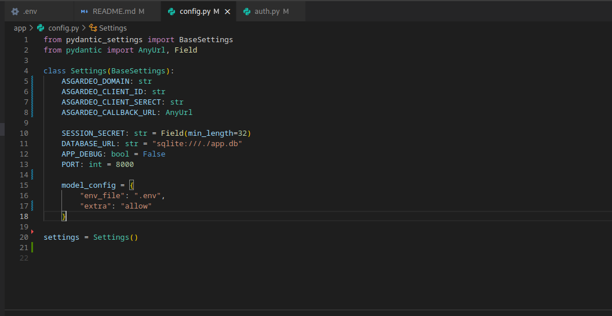

# Auth FastAPI App - Setup Instructions

## change file 



## 1. Create a virtual environment
Run the following command to create a Python virtual environment:

    python3 -m venv .venv

Activate the virtual environment:

- On macOS/Linux:

    source .venv/bin/activate

- On Windows (PowerShell):

    .venv\Scripts\Activate.ps1

## 2. Install dependencies
Install all required packages from `requirments.txt`:

    pip install -r requirments.txt

## 3. Create a .env file 
## move to Asgadeo 
In the project root, create a `.env` file and add the following:

    AUTH0_DOMAIN=
    AUTH0_CLIENT_ID=
    AUTH0_CLIENT_SECRET=
    AUTH0_AUDIENCE=https://your-api-identifier
    AUTH0_CALLBACK_URL=http://localhost:8001/callback

    new env
    ```
    SESSION_SECRET=
    DATABASE_URL=sqlite:///./app.db
    APP_DEBUG=true
    PORT=8001

    ASGARDEO_DOMAIN=
    ASGARDEO_CLIENT_ID=
    ASGARDEO_CLIENT_SERECT=
    ASGARDEO_CALLBACK_URL=http://localhost:8001/callback
    ```

Make sure to fill in the values for Auth0 credentials and `SESSION_SECRET` (at least 32 characters).

## 4. Run the application
Start the FastAPI app using:

    python3 -m app.main

## 5. Access the application
Open your browser and navigate to:

    http://localhost:8001

You should see the app running.
